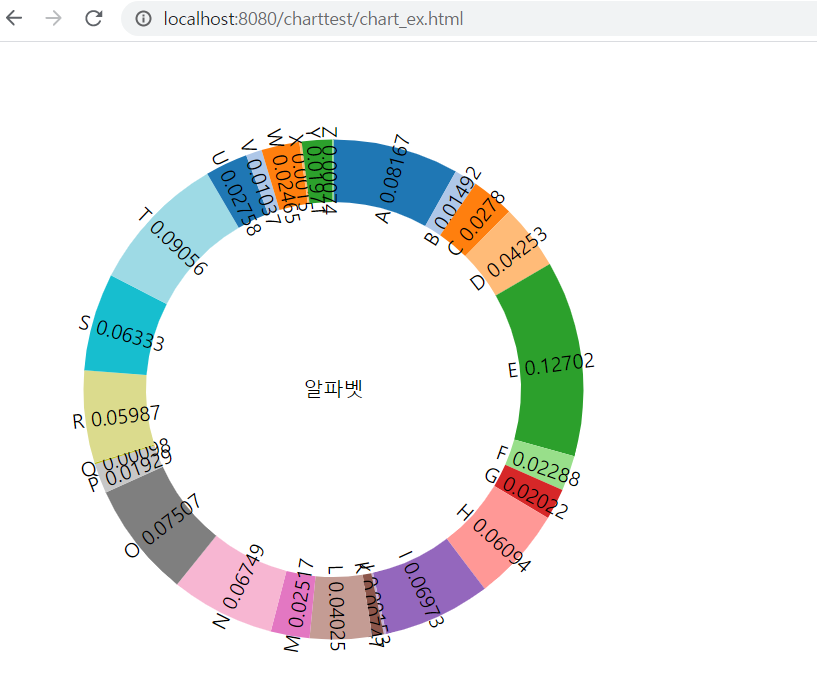
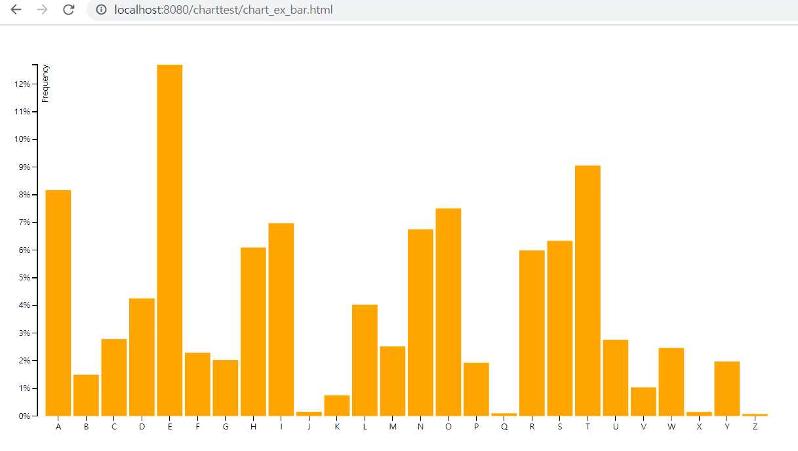
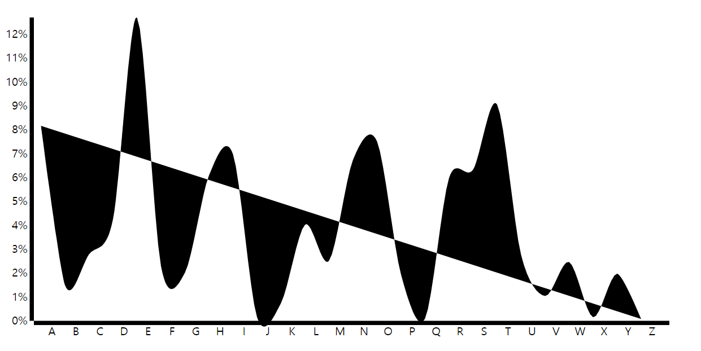
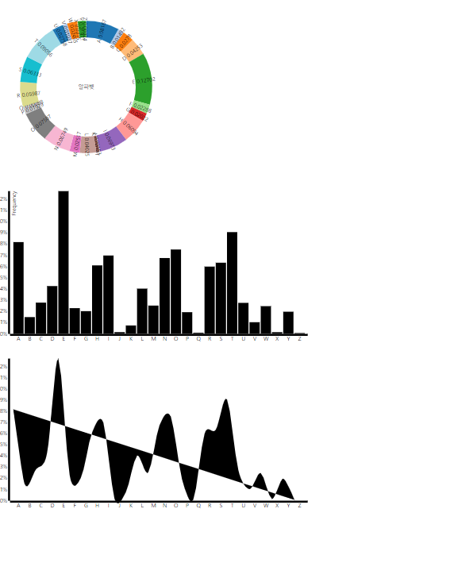

## d3.js를 이용한 데이터 시각화
 - N개의 차트 화면에 띄우기(완료)
 - 차트 데이터 인터페이스 작성(완료)
 - JSON 형태로 차트 데이터 응답(진행중)
  - 데이터를 가져올 수 없을 시 공사 중 이미지 출력(진행중)
 - 이미지
 
 
 
 

 ## 질문사항
 - 예시를 보면 모두 svg, g, path 태그를 추가 시키는데 정해진 이름인가요 아니면 사용자가 원하는 이름으로 할 수 있는 건가요 ?

 - 인터넷에서 예시를 찾아보면 generate라는 함수를 이용해 좀 더 편하게 차트를 생성하는 방법도 있던데 저희가 수행한 방법과 많은 차이가 있나요?

 - 현업에서는 어떤 방식을 많이 사용하나요?

 - restful방식으로 요청하여 json 형식으로 받았을 때 데이터를 바인딩 하는 방법을 잘 모르겠습니다. [코드 링크](./Qcode.html)
