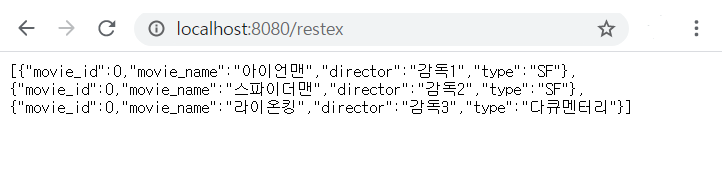
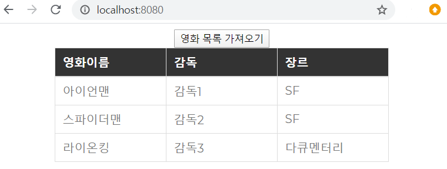

## Spring RESTful API 구현을 위한 설정 및 테스트
 - pom.xml에 jackson 관련 라이브러리 추가 (완료)
 
 - RESTful API 구현을 위한 RestController 생성(완료)
 
 - @RestController 어노테이션을 이용하여 해당 컨트롤러가 REST방식을 이용하는 컨트롤러임을 지정(완료)
 
 - 데이터를 불러와 JSON형식으로 응답(완료)
 
 - 정적인 자원 css, js 폴더 Resource폴더 아래 별도로 생성하여 저장(완료)
 
 - servlet-context.xml에 js,css 폴더위치를 명시하기 위한 설정 추가(완료)
 
 - Ajax를 이용해 불러온 데이터를 javascript를 이용하여 데이터 바인딩(완료)
 
 - 결과 이미지
 

 

 ## 질문사항
 - jquery가 3.x 버전까지 있는데 구버전인 1.12.4 버전을 사용하는 이유가 있나요? 
 
