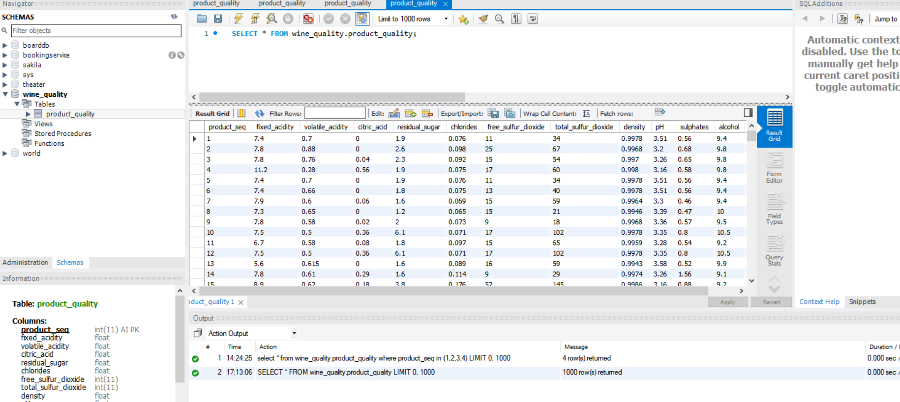
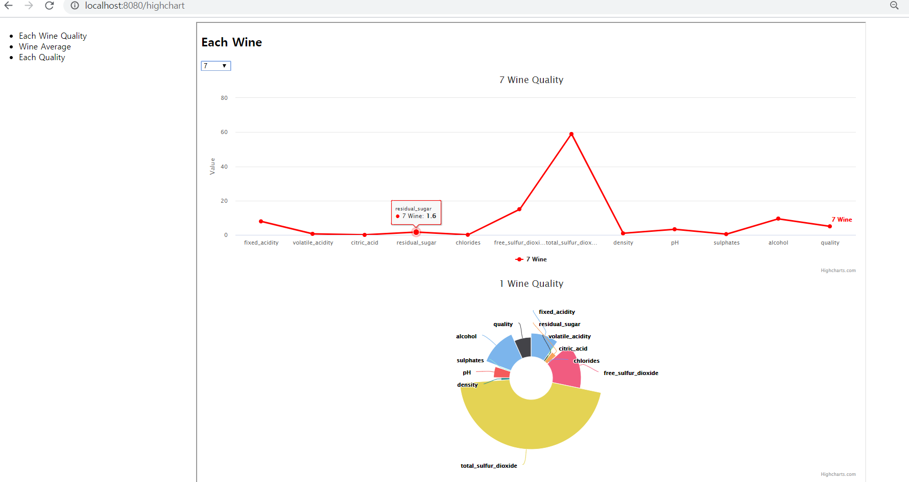
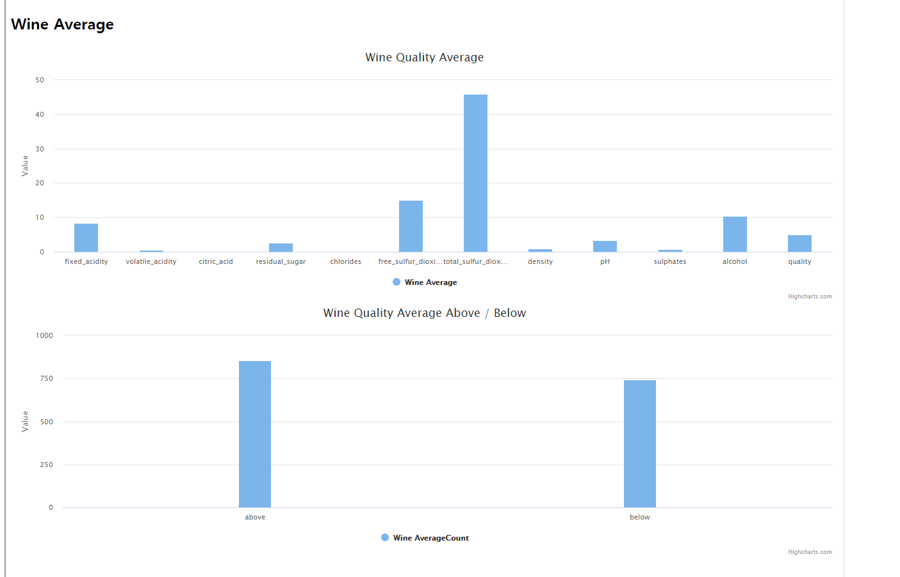
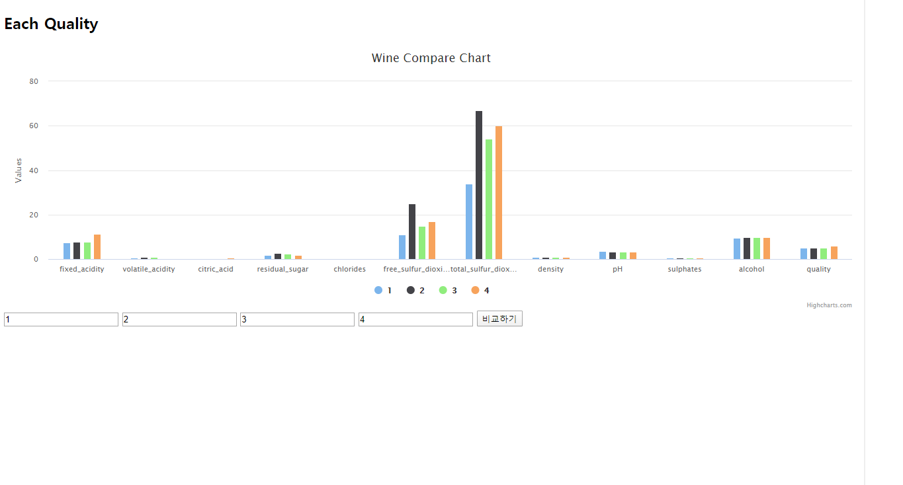
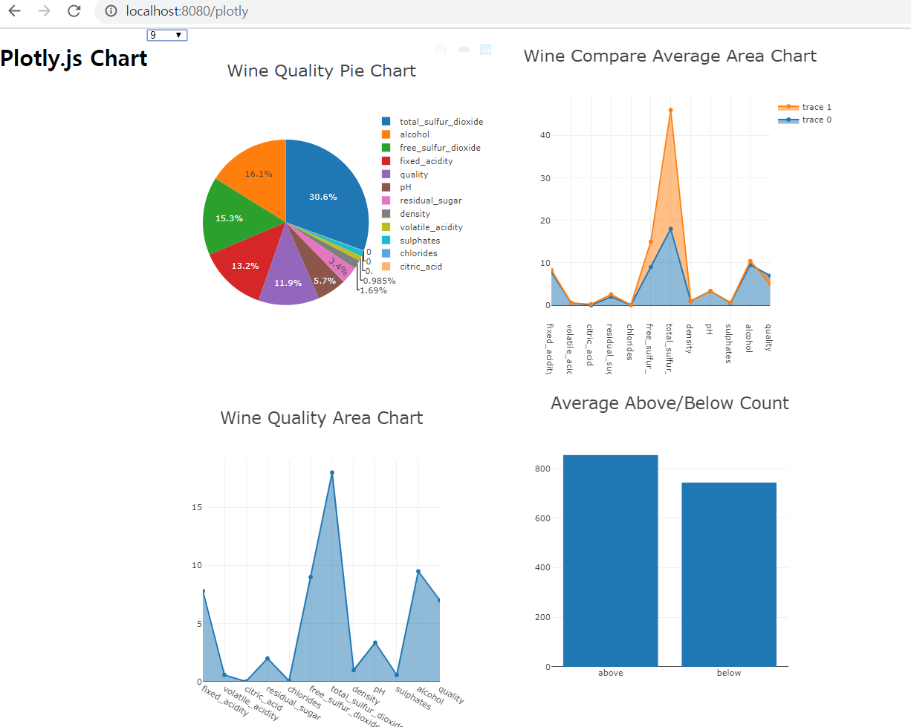

## 데이터 시각화 
 - csv파일에 저장된 wine quality 데이터 데이터베이스에 저장
 

 - highchart 라이브러리를 이용하여 와인 quality 데이터 시각화
 
    - 각각의 와인 quality데이터 line, pie chart를 이용하여 시각화

    

    - 데이터베이스에 저장된 와인 전체의 품질 평균 데이터 column chart를 이용하여 시각화

    - 평균 이하, 이상의 개수 데이터 column chart를 이용하여 시각화

    

    - 4개의 와인을 선택하여 서로의 품질 비교 데이터 column chart를 이용하여 시각화

    

- plotly 라이브러리를 이용하여 와인 quality 데이터 시각화
 
    - 각각의 와인 quality데이터 pie, area chart를 이용하여 시각화

    - 와인 전체의 평균 품질 데이터와 선택된 와인 데이터 비교 area chart를 이용하여 시각화

    - 평균 이하, 이상의 개수 데이터 bar chart를 이용하여 시각화
    
    

 
 

 ## 질문사항
 - ajax를 이용할때 여러함수에서 각각 사용도록 하였는데 모듈화를 하는게 좋은 방법인가요?
 
 - ajax요청할때 url을 하드코딩하지 않고 관리하는 방법이 있나요?
 
 - 다른 Spring 프로젝트를 보면 데이터베이스 접근할 때 DAO @Repository를 이용하는 방법과 @Mapper를 이용하는 방법이 있던데 어떤 방법을 더 많이 선호하나요? 
 